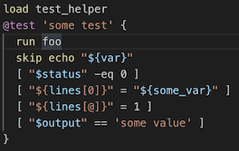
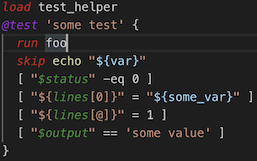

# BATS (Bash Automated Testing System) for VSCode

[

][marketplace]
 [][github]
[][MIT]

This extension adds language support for the [Bats] (Bash Automated Testing System) testing framework to [VS Code][vscode].

## ![tada][_tada] Features


- [x] **Bats** language support for VSCode
- [x] Syntax highlighting for core functions
- [x] Syntax highlighting for community modules
- [x] Code Snippets for quick coding for core functions
- [x] Code Snippets for quick coding for community modules

[][Bats]

## ![bat][_bat] Bats

[Bash Automated Testing System (2021)][bats-core] is a [community-maintained][@bats-core] Bats project.
> (c) 2011-2016 [Sam Stephenson][@sstephenson]\
> (c) 2017-2021 [bats-core organization][@bats-core]

Bats is a [TAP]-compliant testing framework for Bash. It provides a simple way to verify that the UNIX programs you write behave as expected.

A **`.bats`** test file is a Bash script with special syntax for defining test cases. Under the hood, each test case is just a function with a description.

> ![Note][_information_source] \
> See [bats-core README][bats-readme] for documentation on how to use [Bats].

<!-- next color rebeccapurple, thistle, darkcyan, sandybrown, darkseagreen -->

### Bats modules

Project | version | code snippets | syntax highlighting
 :--- | ---: |  :---: | :---:
<https://github.com/bats-core/bats-core>      | [![bats-core project][badge-core]][bats-core-l]          | ![Y][_white_check_mark] | ![Y][_white_check_mark]
<https://github.com/bats-core/bats-assert> | [![bats-assert project][badge-assert]][bats-assert-l]    | ![Y][_white_check_mark] | ![Y][_white_check_mark]
<https://github.com/bats-core/bats-support>  | [![bats-support project][badge-support]][bats-support-l] | ![N][_negative_squared_cross_mark] | ![Y][_white_check_mark]
<https://github.com/bats-core/bats-file>        | [![bats-file project][badge-file]][bats-file-l]          | ![N][_negative_squared_cross_mark] | ![Y][_white_check_mark]
<https://github.com/lox/bats-mock>            | [![bats-mock project][badge-mock]][bats-mock-l]          | ![N][_negative_squared_cross_mark] | ![Y][_white_check_mark]

## ![scissors][_scissors] Snippets

These modules have snippets:

- [x] <https://github.com/bats-core/bats-core>
- [x] <https://github.com/bats-core/bats-assert>
- [ ] <https://github.com/bats-core/bats-support>
- [ ] <https://github.com/bats-core/bats-file>
- [ ] <https://github.com/lox/bats-mock>

Type `BATS:*snippet*` to use snippets.

[![bats-core snippets][badge-core]][bats-core-l]

- [x] **BATS:env**               : shebang.
- [x] **BATS:setup**             : Setup function.
- [x] **BATS:teardown**          : Teardown function.
- [x] **BATS:load**              : Load common code.
- [x] **BATS:bats_load_library** : Load system-wide libraries.
- [x] **BATS:test**              : Test case.
- [x] **BATS:status**            : Test status code.
- [x] **BATS:output**            : Test output.
- [x] **BATS:line**              : Test line output.
- [x] **BATS:skip**              : Skip test.

[![bats-assert snippets][badge-assert]][bats-assert-l]

- [x] **BATS:assert**
- [x] **BATS:assert_output**
- [x] **BATS:assert_line**
- [x] **BATS:assert_success**
- [x] **BATS:assert_failure**
- [x] **BATS:assert_equal**
- [x] **BATS:assert_not_equal**
- [x] **BATS:refute**
- [x] **BATS:refute_output**
- [x] **BATS:refute_line**

<!-- [![bats-support snippets][badge-support]][bats-support-l]\
![construction][_construction] -->

<!-- [![bats-file snippets][badge-file]][bats-file-l]\
![construction][_construction] -->

<!-- [![bats-mock snippets][badge-mock]][bats-mock-l]\
![construction][_construction] -->

## ![flashlight][_flashlight] Syntax highlighting

These modules have syntax highlighting support:

- [x] <https://github.com/bats-core/bats-core>
- [x] <https://github.com/bats-core/bats-assert>
- [x] <https://github.com/bats-core/bats-support>
- [x] <https://github.com/bats-core/bats-file>
- [x] <https://github.com/lox/bats-mock>

<!--  <https://github.com/grayhemp/bats-mock> :thinking: -->

### ![art][_art] Color customizations

If you want `Bats` syntax highlighting to look different to `shellscript` syntax, you can change your user preferences or workspace settings (`.vscode/settings.json`).

Default theme, for `shellscript`:



Example after saving the `editor.tokenColorCustomizations` settings below.



Add this to your VS Code settings.

```json
{
    "editor.tokenColorCustomizations": {
        "textMateRules": [
            {
                "scope": "keyword.control.bats",
                "settings": {
                    "foreground": "#9f1fd1",
                    "fontStyle": "italic"
                }
            },
            {
                "scope": "support.function.bats",
                "settings": {
                    "foreground": "#d41515",
                    "fontStyle": "italic"
                }
            },
            {
                "scope": "support.variable.bats",
                "settings": {
                    "foreground": "#329432",
                    "fontStyle": "italic"
                }
            }
        ]
    }
}
```

[][Bats]

## Installation

### Extension Marketplace

This extension is published in the [VSCode marketplace][marketplace].

 1. Run [Install Extensions] from the [Command Palette]
 1. Search and choose  [**`bats`**][marketplace].

### Release Notes

See [Changelog].

### ![exclamation][_exclamation]Known Issues

[][issues]

Feel free to report any [issues][new issue].

## Related Projects

If you like [Bats], you may also like [ShellCheck][shellcheck] and the [VSCode extension][vscode-shellcheck]

This extension was inspired by [sublime-bats].

## ![scroll][_scroll] License

[][humanstxt]

[MIT]

<!-- Links -->

[Bats]: <https://github.com/bats-core/bats-core>
[v1.5.0]: <https://github.com/bats-core/bats-core/releases/tag/v1.5.0>
[sBats]: <https://github.com/sstephenson/bats>
[@sstephenson]: <https://github.com/sstephenson>
[@bats-core]: <https://github.com/bats-core>
[TAP]: <https://testanything.org/>
[Bash]: <https://www.gnu.org/software/bash/>
[bats-readme]: <https://github.com/bats-core/bats-core/blob/master/README.md>
[marketplace]: <https://marketplace.visualstudio.com/items?itemName=jetmartin.bats>
[github]: <https://github.com/bats-core/bats-vscode>
[issues]: <https://github.com/bats-core/bats-vscode/issues>
[new issue]: <https://github.com/bats-core/bats-vscode/issues/new>
[Changelog]: <https://github.com/bats-core/bats-vscode/blob/master/CHANGELOG.md>
[MIT]: <https://jet-martin.mit-license.org/2017>
[humanstxt]: <https://github.com/bats-core/bats-vscode/blob/master/humans.txt>

[bats-core]: <https://github.com/bats-core/bats-core>
[bats-assert]: <https://github.com/bats-core/bats-assert>
[bats-support]: <https://github.com/bats-core/bats-support>
[bats-file]: <https://github.com/bats-core/bats-file>
[bats-mock]: <https://github.com/lox/bats-mock>
[grayhemp-mock]: <https://github.com/grayhemp/bats-mock>

[bats-core-l]: <https://github.com/bats-core/bats-core/releases/latest>
[bats-assert-l]: <https://github.com/bats-core/bats-assert/releases/latest>
[bats-support-l]: <https://github.com/bats-core/bats-support/releases/latest>
[bats-file-l]: <https://github.com/bats-core/bats-file/releases/latest>
[bats-mock-l]: <https://github.com/lox/bats-mock/releases/latest>

[badge-core]: <https://img.shields.io/github/release/bats-core/bats-core.svg?style=flat-square&labelColor=olivedrab&color=grey&label=bats-core>
[badge-assert]: <https://img.shields.io/github/package-json/v/bats-core/bats-assert.svg?label=bats-assert&style=flat-square&labelColor=royalblue&color=grey>
[badge-support]: <https://img.shields.io/github/package-json/v/bats-core/bats-support.svg?style=flat-square&color=grey&labelColor=sienna&label=bats-support>
[badge-file]: <https://img.shields.io/github/package-json/v/bats-core/bats-file.svg?style=flat-square&color=grey&labelColor=indianred&label=bats-file>
[badge-mock]: <https://img.shields.io/github/release/lox/bats-mock.svg?style=flat-square&color=grey&labelColor=orchid&label=bats-mock>

[command palette]: <https://code.visualstudio.com/Docs/editor/codebasics#_command-palette>
[install extensions]: <https://code.visualstudio.com/docs/editor/extension-gallery#_install-an-extension>
[Visual Studio Code]: <https://code.visualstudio.com/>
[vscode]: <https://code.visualstudio.com/>
[shellcheck]: <https://shellcheck.net/>
[vscode-shellcheck]: <https://marketplace.visualstudio.com/items?itemName=timonwong.shellcheck>
[sublime-bats]: <https://github.com/jverdeyen/sublime-bats>

[_art]: <https://cdn.jsdelivr.net/gh/bats-core/bats-vscode/images/_art.png>
[_bat]: <https://cdn.jsdelivr.net/gh/bats-core/bats-vscode/images/_bat.png>
[_construction]: <https://cdn.jsdelivr.net/gh/bats-core/bats-vscode/images/_construction.png>
[_copyright]: <https://cdn.jsdelivr.net/gh/bats-core/bats-vscode/images/_copyright.png>
[_exclamation]: <https://cdn.jsdelivr.net/gh/bats-core/bats-vscode/images/_exclamation.png>
[_flashlight]: <https://cdn.jsdelivr.net/gh/bats-core/bats-vscode/images/_flashlight.png>
[_information_source]: <https://cdn.jsdelivr.net/gh/bats-core/bats-vscode/images/_information_source.png>
[_negative_squared_cross_mark]: <https://cdn.jsdelivr.net/gh/bats-core/bats-vscode/images/_negative_squared_cross_mark.png>
[_scissors]: <https://cdn.jsdelivr.net/gh/bats-core/bats-vscode/images/_scissors.png>
[_scroll]: <https://cdn.jsdelivr.net/gh/bats-core/bats-vscode/images/_scroll.png>
[_tada]: <https://cdn.jsdelivr.net/gh/bats-core/bats-vscode/images/_tada.png>
[_white_check_mark]: <https://cdn.jsdelivr.net/gh/bats-core/bats-vscode/images/_white_check_mark.png>
